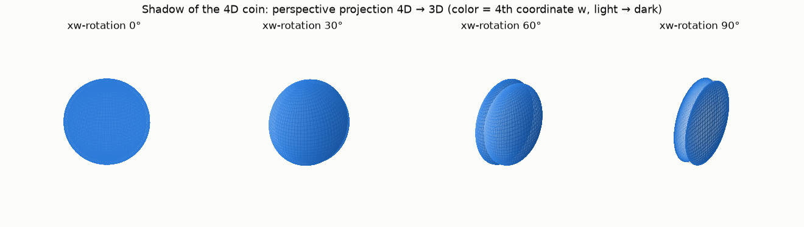
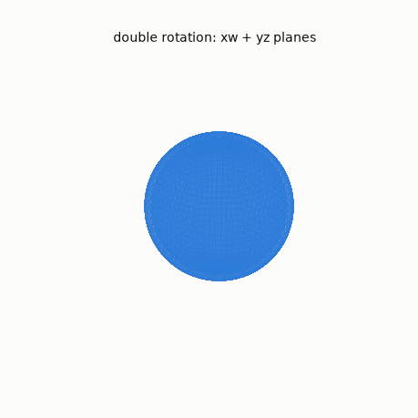
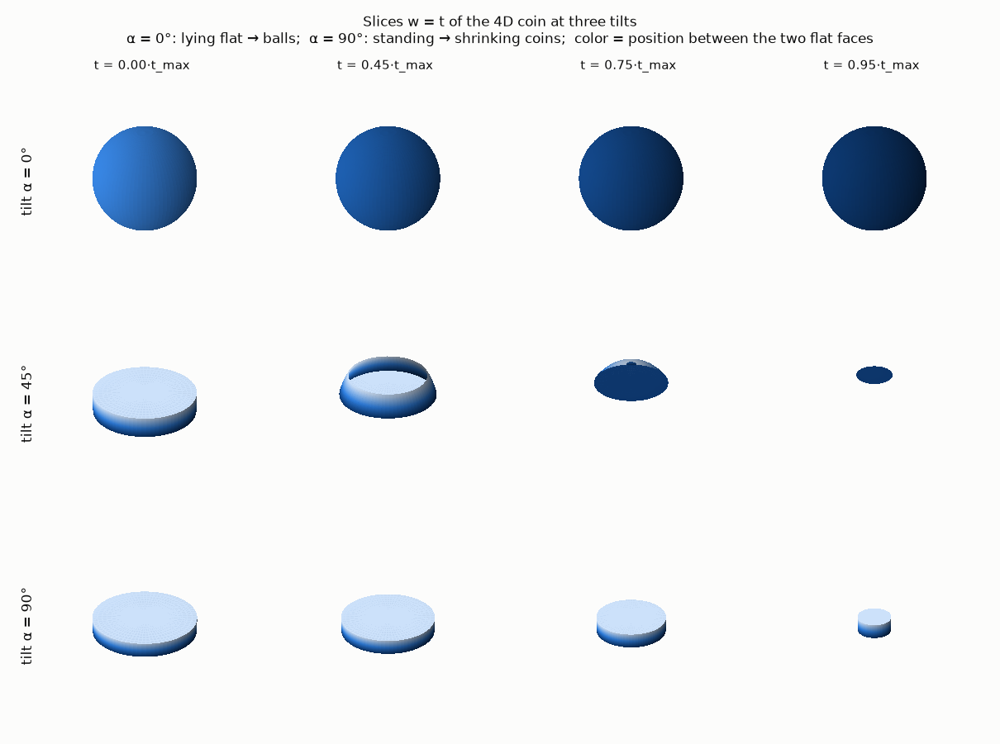
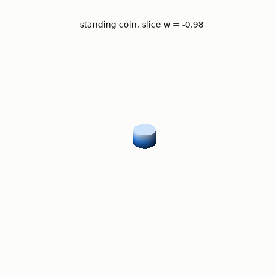

# The 4D coin — visualizing a spherinder

What would a coin look like in 4D space? This project works out the geometry
and renders it two complementary ways, with both static (matplotlib) and
interactive (plotly) output.

## The mathematics

### From coin to spherinder

A 3D coin is a *solid of extrusion*: take a flat 2D disk and thicken it a
short distance along the one axis perpendicular to it,

```
coin      =  D²(r) × [−h/2, h/2]   ⊂ ℝ³        (r ≫ h)
```

Its boundary splits into two **flat** faces (disks, each lying in a 2D plane —
heads and tails) and one **curved** face (the rim, a circle × interval).

The construction generalizes by raising the dimension of the round part.
In 4D the disk becomes a solid 3-ball, and the result is the **spherinder**:

```
4D coin   =  B³(r) × [−h/2, h/2]   ⊂ ℝ⁴
          =  { (x, y, z, w) : x² + y² + z² ≤ r²,  |w| ≤ h/2 }
```

Its boundary consists of three cells:

| cell | geometry | flat or curved |
|---|---|---|
| "heads" face at w = −h/2 | solid ball B³(r) | flat (lies in a 3D hyperplane) |
| "tails" face at w = +h/2 | solid ball B³(r) | flat |
| rim | sphere × interval, S²(r) × [−h/2, h/2] | curved |

So the "flat-ish surface" of a 4D coin is an entire **solid 3D ball**. A 4D
coin tossed onto a 3D floor-hyperplane lands with a full ball of contact
(heads or tails) — or balances on its spherical rim.

Measures: hypervolume = (4/3)πr³·h; boundary 3-volume = 2·(4/3)πr³ + 4πr²h
(two ball caps + rim). The other "4D cylinders" — the cubinder D² × [0,h]²
and the duocylinder D² × D² — are *not* coins: the cubinder has four flat
cells, the duocylinder none at all.

### Seeing 4D in 3D

Screens render 3D at best, so a dimension-reducing map is needed. Two
standard, complementary choices:

**Projection (the shadow).** First rotate in 4D, then project. 4D rotations
happen in *planes*, not around axes; ℝ⁴ has six coordinate planes
(xy, xz, yz, xw, yw, zw), and rotations in the three planes containing w are
the ones with no 3D counterpart. 4D even admits *double rotations* — two
independent planes turning at once (e.g. xw + yz), which never happens in 3D.
After rotating, the perspective projection

```
(x, y, z, w)  ↦  (x, y, z) · d / (d − w)
```

magnifies parts of the object that are near in w and shrinks parts that are
far — exactly the trick that turns a tesseract into the familiar
cube-inside-a-cube shadow. For the spherinder the shadow is a
*sphere inside a sphere* (the two boundary spheres of the flat faces), joined
by the rim cell; a w-plane rotation slides the spheres apart and through each
other.

**Slicing (the scan).** Intersect with the hyperplane w = t and animate t —
the 4D version of an MRI scan, and how a 3D-bound observer would experience a
4D object passing through their space. Tilt the coin by α in the zw-plane; a
point (x, y, z) of the slice pulls back to object coordinates

```
Z = z·cos α + t·sin α ,   W = t·cos α − z·sin α ,
```

and belongs to the slice iff x² + y² + Z² ≤ r² and |W| ≤ h/2. Since x, y
enter only through x² + y², **every slice is a solid of revolution** about
the z-axis with the closed-form radius profile ρ(z) = √(r² − Z(z)²) — this is
what `spherinder.slice_solid` computes. The two extremes:

* **α = 0 (coin lying flat):** every slice is a full ball of radius r that
  appears at t = −h/2 and vanishes at t = +h/2;
* **α = 90° (coin standing on its rim):** the slices are ordinary 3D coins of
  radius √(r² − t²) — a family of shrinking coins.

Throughout, the 4th coordinate is encoded as a sequential single-hue color
ramp (light → dark blue): in the shadow view color = rotated depth w′, in the
slice view color = W, the position between the heads face (light) and the
tails face (dark).

## Files

| file | what it is |
|---|---|
| `spherinder.py` | math core: 4D rotations, perspective projection, closed-form slices |
| `render_static.py` | matplotlib renders: the PNG stills and GIFs below |
| `build_interactive.py` | generates `spherinder_interactive.html` (inlines the vendored three.js) |
| `vendor/three.module.js` | three.js r170, vendored so the built page works offline |
| `spherinder_interactive.html` | cinematic WebGL one-pager (open in any browser, works offline). All 4D math runs in GLSL vertex shaders — static geometry, uniforms drive the rotation and the slice. An autonomous ~40 s choreography loops: double-rotation shadow → tilt upright → a glowing slice sweeps through the ghost (the shrinking coins) → flat scan (balls popping in and out, tails-first) → unwind. Drag to orbit, scroll to zoom; honors `prefers-reduced-motion`; `?static=SECONDS` freezes the timeline at any moment |

Run with `pip install numpy matplotlib`, then `python render_static.py`;
`python build_interactive.py` needs only the Python standard library.

## Renders

**Shadow.** Perspective projection after rotating in the xw-plane — the two
boundary spheres (heads light, tails dark) separate and pass through each
other:





**Scan.** Slices w = t at three tilts — balls when lying flat, shrinking
coins when standing on the rim:




